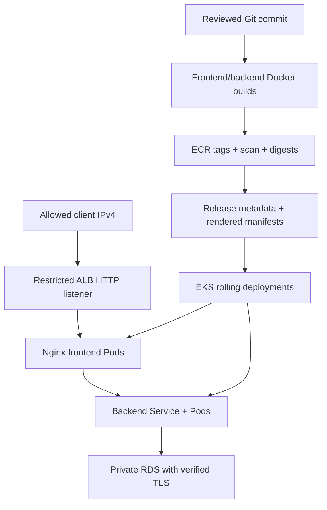

# Phase 6 — real application deployment and release acceptance

Prepared 9 October 2026 for aws-eks-ops-platform / OpsFlow on Windows PowerShell.

## 1. What this phase means

We are deploying your actual OpsFlow frontend/backend and its incident database. We are not replacing the application with a tutorial placeholder. Phase 5 already supplied EKS, RDS, the controller and application manifests. Phase 6 makes deployment a repeatable release with evidence, verification and a rollback target.

The actual application source/Dockerfiles are not available in this workspace, and public GitHub retrieval failed. The included scripts operate on your existing repository, Phase 5 templates and Terraform outputs. They have not been merged into or executed against your live app/account. Do not mistake an archive being prepared for an AWS deployment having succeeded.

Your latest supplied logs contained `/ready` = 503, empty `$OpsRegion`/`$OpsContext` symptoms, and a later Phase 5 destroy plan. A destroy *plan* does not prove destruction completed. This phase checks the current state before building or deploying; it never automatically recreates infrastructure or discards data.

Outcomes:

- Restore a fresh PowerShell session with explicit account/region/context.
- Confirm whether Phase 5 exists, is healthy and has usable database state.
- Verify the real app contract and local behavior before a release.
- Build linux/amd64 images from a clean Git commit, push immutable release tags, wait for completed ECR basic scans, deploy by digest.
- Render existing AWS templates with environment-specific values and a configuration checksum that rolls Pods when ConfigMaps change.
- Capture prior application resources for rollback without copying secrets.
- Verify Deployment images/readiness, ALB HTTP endpoints, incident create/read and the actual browser UI.
- Prove incidents survive backend Pod replacement; exercise a real prior-release rollback.
- Document the results and tear down billable resources correctly.

Manual release first; GitHub Actions/OIDC automation comes after this workflow works. No new Terraform root, public domain or NAT Gateway is added in Phase 6.

## 2. Architecture and production relevance



Release identity answers “what commit and images are running?” Readiness answers “can this Pod serve requests?” Acceptance proves the real browser/API/database flow. Rollback restores the previous application image and configuration; it does not reverse database changes.

This remains the Phase 5 lab: public workers without SSH, private single-AZ RDS, HTTP ingress restricted to your IP, manual app secret bootstrap. It is suitable for a controlled learning release, not a public production service. HTTPS/authentication, private-worker egress, scoped runtime DB permissions, secret rotation, CI/CD and full monitoring remain separate work.

## 3. Files to add

| File | Purpose |
|---|---|
| scripts/phase6/Common.ps1 | Native command errors, JSON handling, account/context validation |
| scripts/phase6/Preflight.ps1 | Reads actual Phase 5 outputs and checks EKS/nodes/private RDS |
| scripts/phase6/Build-Release.ps1 | Builds/pushes images, gates basic scans, writes a release record |
| scripts/phase6/Render-Release.ps1 | Uses existing Phase 5 templates and adds ConfigMap checksum |
| scripts/phase6/Deploy-Release.ps1 | Checks dependencies, captures baseline, server-validates/applies, waits for rollouts |
| scripts/phase6/Verify-Release.ps1 | Checks selected images/readiness and HTTP/API flow |
| scripts/phase6/Rollback-Release.ps1 | Restores a complete prior healthy resource baseline |
| scripts/phase6/diagnose-db.cjs | Runs against the real Pool inside a backend Pod; prints non-secret configuration and TLS/table evidence |
| .phase6/.gitignore | Excludes generated environment-specific release files |
| docs/phase6-real-application-deployment.md | Full guide |
| docs/phase6-results-template.md | Evidence checklist to fill with real results |

Generated files are under `.phase6/releases`, `.phase6/rendered`, `.phase6/baselines` and `.phase6/verification`. They contain image IDs/environment metadata, not credentials. Preserve the prior release/baseline privately if you need it after laptop shutdown; write the important non-secret results into Git documentation.

Copy these folders into the existing repository, preserving its README and Phase 4/5 files. Do not move application code into a new repository. Do not apply Phase 3 kind manifests to EKS.

## 4. Fresh PowerShell session: fix the previous empty-variable failures

```powershell
Set-Location 'C:\Users\ROHIT\Desktop\aws-eks-ops-platform'
$OpsRepoRoot = (Get-Location).Path
$OpsRegion = 'ap-south-1'
$OpsCluster = 'opsflow-lab'
$OpsContext = 'opsflow-eks'
$OpsExpectedAccount = '952078551971' # account shown in your recent Phase 5 outputs; independently verify it
$env:AWS_REGION = $OpsRegion
$env:AWS_DEFAULT_REGION = $OpsRegion
$env:AWS_PAGER = ''
# Set your actual authorized profile if using a named profile:
$env:AWS_PROFILE = 'opsflow-lab'
aws sts get-caller-identity
```

Use the profile you actually configured; the example name is not a new credential setup. If it is SSO, renew its session with `aws sso login --profile YOUR_ACTUAL_PROFILE`. Verify the displayed Account is the intended one before any mutation.

```powershell
[pscustomobject]@{
  Region=$OpsRegion
  Cluster=$OpsCluster
  Context=$OpsContext
  ExpectedAccount=$OpsExpectedAccount
}
Get-ChildItem Env:AWS* | Select-Object Name
```

`--region: expected one argument` was consistent with an empty `$OpsRegion`. An empty `$OpsContext` can shift kubectl's arguments and produce misleading plugin/flag errors. These are different from a real database connection failure. PowerShell session variables disappear when you close/restart the terminal.

If environment credentials override the intended profile, inspect variable *names*, verify which authentication method you use, then remove only stale overrides. Never paste credential values, Secret YAML or passwords into chat/logs.

Check tools and versions:

```powershell
aws --version
terraform version
kubectl version --client
helm version
node --version
npm --version
docker info
git status --short
```

Use Terraform >=1.10, AWS CLI v2, Linux containers in Docker Desktop, and a kubectl client within one minor of the actual EKS control-plane version. Respect local PowerShell script execution policy; inspect the scripts rather than globally disabling policy.

## 5. Does Phase 5 still exist?

```powershell
Set-Location (Join-Path $OpsRepoRoot 'infrastructure\phase5')
terraform init -backend-config=backend.hcl
if ($LASTEXITCODE -ne 0) { throw 'Backend initialization failed' }
terraform output
terraform state list
aws eks describe-cluster --name $OpsCluster --region $OpsRegion --query 'cluster.{Status:status,Version:version,Endpoint:endpoint}'
aws rds describe-db-instances --db-instance-identifier opsflow-lab-postgres --region $OpsRegion --query 'DBInstances[0].{Status:DBInstanceStatus,Address:Endpoint.Address,PubliclyAccessible:PubliclyAccessible}'
```

Expected `PubliclyAccessible` value: false.

Choose the matching situation:

| Current evidence | Required action |
|---|---|
| Outputs/resources exist and EKS/RDS are healthy | Continue after refreshing kubeconfig |
| Destroy plan was generated, but resources still exist | Review state/drift; do not assume the plan executed |
| Phase 5 was destroyed; Phase 4 remains | Recreate Phase 5 using its existing state/config and a reviewed new plan; this restarts billable resources |
| RDS was deleted and final snapshot retained | Decide whether old incidents must be restored before provisioning a replacement DB |
| Terraform outputs and AWS disagree | Diagnose state/account/region; never delete state to hide the mismatch |

If you deliberately want a new empty lab after destruction, follow the existing Phase 5 guide: plan/apply infrastructure, install controller, load CA, create app credentials/user and apply actual schema. Use a new unique final_snapshot_identifier. This does not restore old incidents automatically.

If old data is required, stop the fresh-DB path. A snapshot restore must be explicitly incorporated into the RDS Terraform configuration (snapshot_identifier, supported instance/engine settings, unique instance identifier, parameter/subnet/security groups and secret management). Do not run a separate console restore with the same name and then pretend Terraform owns it. The restored app role retains its old password; a lost Kubernetes app Secret must be recovered or deliberately rotated. The Phase 5 role-creation script does not rotate existing roles. Keep the snapshot until recovery is proven.

A DB restore is a separate billable resource operation and must preserve actual state/data requirements; the Phase 6 release scripts do not make that decision for you.

For an existing/recreated healthy cluster:

```powershell
aws eks update-kubeconfig --name $OpsCluster --region $OpsRegion --alias $OpsContext
if ($LASTEXITCODE -ne 0) { throw 'Kubeconfig update failed' }
Set-Location $OpsRepoRoot
.\scripts\phase6\Preflight.ps1 -ExpectedAccountId $OpsExpectedAccount `
  -Region $OpsRegion -Cluster $OpsCluster -Context $OpsContext
```

Preflight checks the explicit context's API endpoint against the live EKS endpoint; your current/default kind context cannot silently become the target. It also checks Ready nodes and private available RDS. It does not prove app schema/readiness.

Review Phase 5 Terraform drift before release:

```powershell
Set-Location .\infrastructure\phase5
terraform plan -detailed-exitcode
$OpsPlanExit = $LASTEXITCODE
if ($OpsPlanExit -eq 1) { throw 'Infrastructure plan failed' }
if ($OpsPlanExit -eq 2) { throw 'Review infrastructure drift before release' }
Set-Location $OpsRepoRoot
```

## 6. Real application contract and local checks

Use your real files; inspect these without scanning node_modules:

```powershell
Get-Content .\backend\package.json
Get-Content .\frontend\package.json
Get-Content .\backend\Dockerfile
Get-Content .\frontend\Dockerfile
Get-Content .\backend\src\db\pool.js
Get-Content .\backend\src\config\pg-options.cjs
Get-ChildItem .\backend\src -Recurse -File | Select-String -Pattern 'router\.(get|post|patch|put|delete)|app\.use|dotenv'
Get-Content .\database\init.sql
```

From your supplied logs, the backend is CommonJS and `backend/src/db/pool.js` uses `buildPgOptions(process.env)`. Preserve that actual Pool export and error handler. Do not create a second Pool or replace the incident schema with an unrelated sample.

Verify:

- DB variables are loaded before the Pool is created. Direct `node` execution, npm execution and Docker Compose can load configuration differently.
- Dockerfiles use dependency lockfiles/npm ci, contain the real app and expose the expected ports (backend 3000, Nginx 8080).
- Frontend calls `/api/...` through the same origin in deployed mode, not localhost:3000 or a baked-in old endpoint.
- Frontend Nginx serves actual compiled assets and SPA routes.
- Both build contexts exclude real `.env`, `.env.*`, credential files, node_modules and Git data. Review negation rules so exclusions are not reversed. A `.gitignore` alone does not control Docker COPY.
- `database/init.sql` is a real schema file matching incident queries, not a directory or a superuser/local-database initialization script.
- `/health` is process liveness; `/ready` queries the database with bounded timeout.

For tests, run the scripts that actually exist in each package.json. Do not invent `npm run test:ci` or consider a missing test script a passed test. Install dependencies using npm ci where package-lock.json is present. Build the actual frontend using its declared build script. Run backend tests with the required test DB/configuration; do not point tests at real RDS data accidentally.

Use your existing local Docker Compose environment to verify health/readiness and incident create/read first. Check `docker compose config --services` before using service names; do not dump an expanded Compose configuration if it contains passwords. Fix local API bugs before blaming EKS.

## 7. Resolve `/ready` = 503 with evidence

A 503 proves the readiness check failed, not which database setting is wrong. Diagnose the actual Pod and actual Pool:

```powershell
kubectl --context $OpsContext get pods -n opsflow -l app=backend -o wide
$OpsBackendPod = kubectl --context $OpsContext get pods -n opsflow -l app=backend -o jsonpath='{.items[0].metadata.name}'
if ([string]::IsNullOrWhiteSpace($OpsBackendPod)) { throw 'No backend Pod exists; finish first-deployment prerequisites below' }
kubectl --context $OpsContext logs $OpsBackendPod -n opsflow --tail=100
kubectl --context $OpsContext describe pod $OpsBackendPod -n opsflow
kubectl --context $OpsContext get configmap opsflow-config -n opsflow -o yaml
kubectl --context $OpsContext get secret opsflow-db-secret -n opsflow -o name
```

Only ConfigMap/non-secret metadata is displayed. Do not print the Secret data.

Run the provided diagnostic inside the backend container:

```powershell
Get-Content .\scripts\phase6\diagnose-db.cjs -Raw | `
  kubectl --context $OpsContext exec -i $OpsBackendPod -n opsflow -- node -
```

It loads the real `src/db/pool.js` relative to the container's working directory. If your actual image uses another layout, inspect its WORKDIR and use the actual absolute Pool path by setting OPS_POOL_MODULE for the command. Do not assume MODULE_NOT_FOUND is a database problem.

Expected: intended RDS host, opsflow DB, opsflow_app user, passwordPresent=true, TLS requested, and query evidence `tls=true`, `incidents_table=true`. The script intentionally fails if TLS/table checks fail. It is meant for EKS/RDS; local plaintext PostgreSQL is not expected to pass the TLS assertion.

| Evidence | Likely cause | Fix |
|---|---|---|
| Missing host/user/password flag | Environment not injected/loaded | Correct ConfigMap/Secret refs and loading order; rebuild if code changed |
| ENOTFOUND | Wrong/stale DB hostname/DNS | Compare actual RDS endpoint with ConfigMap/Phase 5 outputs |
| ETIMEDOUT | Routing or SG access, unavailable RDS | Verify DB available and 5432 from current worker SG; preserve private DB access |
| ECONNREFUSED | Wrong host/port or listener unavailable | Verify endpoint and port/status |
| 28P01 / password authentication failed | App Secret and DB role disagree | Recover or deliberately rotate the app credential; don't silently generate a new random Secret |
| Certificate validation error | Wrong CA/path/hostname | Mount current RDS CA and verify the actual hostname; never use rejectUnauthorized=false |
| SSL off / pg_hba error | Pool does not enable required TLS | Verify helper integration and DB_SSL=true; retain rds.force_ssl |
| incidents_table=false | Schema was not applied to this DB | Run the reviewed schema bootstrap/migration against the right DB/user |

If readiness catch currently hides the error, add a narrowly scoped code/message log to that catch while preserving the 503 response. Never log process.env, passwords, connection URLs or the full client configuration.

## 8. First deployment prerequisites versus an update

For an update, these should already exist:

```powershell
kubectl --context $OpsContext get namespace opsflow
kubectl --context $OpsContext get configmap rds-ca -n opsflow -o name
kubectl --context $OpsContext get secret opsflow-db-secret -n opsflow -o name
kubectl --context $OpsContext get deployment aws-load-balancer-controller -n kube-system
```

For a first deployment after recreating infrastructure, reuse the existing Phase 5 setup: controller, namespace/config, RDS CA ConfigMap, app credential/user and reviewed schema. The Phase 6 scripts do not expose master credentials or silently rerun schema on every app release.

You may build a release before app Secrets exist, but deployment requires them. After Build-Release below, Render-Release produces configmap/namespace files. Apply only those two first; then run the existing Phase 5 CA/database initialization steps against this environment. This supports a first deployment without applying Pods before their dependencies exist.

For a restored DB with an existing app user and missing Secret, the ordinary initialization path is insufficient until that credential is deliberately recovered/rotated. Do not apply a guessed password.

## 9. Commit reviewed source before building

Add Phase 6 scripts/docs and your actual reviewed application fixes; don't copy this package's README over your existing one.

```powershell
Set-Location $OpsRepoRoot
git status --short
git diff
git add scripts/phase6 docs/phase6-real-application-deployment.md docs/phase6-results-template.md .phase6/.gitignore
# Add only the actual reviewed app/test/Dockerfile changes separately.
git diff --cached --stat
git diff --cached
git commit -m 'feat: add repeatable OpsFlow application release workflow'
```

The build script requires a clean working tree so the recorded SHA identifies the built source. Commit/review unrelated changes separately; do not reset or discard them merely to satisfy this check. Runtime release metadata stays ignored under .phase6.

## 10. Build, push, scan and record the release

Set your actual current outbound public IPv4 /32. This must be the address from which your browser reaches the restricted ALB. If EKS public API access uses an old /32 after a VPN/router change, update that Phase 5 input through a reviewed Terraform plan before continuing.

```powershell
$OpsAdminCidr = 'YOUR_ACTUAL_PUBLIC_IPV4/32'
.\scripts\phase6\Build-Release.ps1 `
  -ExpectedAccountId $OpsExpectedAccount `
  -AdminCidr $OpsAdminCidr `
  -Region $OpsRegion -Cluster $OpsCluster -Context $OpsContext
```

The script builds both real application directories using --pull and linux/amd64, labels the images with the Git SHA, pushes a unique release tag and records exact ECR digests. `--pull` refreshes the selected base tag; it does not magically fix a vulnerability in an unsupported/unpatched base or in npm dependencies.

It waits for completed *basic* ECR scans and blocks CRITICAL findings. HIGH and other findings are shown and require actual assessment/remediation before deployment. A zero-CRITICAL basic OS scan is not a complete supply-chain security assessment: add language-dependency review using your actual npm audit/test process and a separate container/application scanner where appropriate.

If the registry now uses enhanced scanning, do not turn it off to satisfy this script. Use its Inspector-aware results/gate instead; the basic-only script intentionally stops. A missing/pending/unsupported scan is not a clean scan. ECR basic scans can be limited to one scan per image per 24 hours; check scan configuration before repeatedly requesting manual scans.

On a scan failure, pushed images may remain in ECR and incur storage charges. No release record is accepted as ready by the successful end of this script. Patch the actual image/dependencies, build a new immutable tag and re-run. Do not change immutable repositories to mutable or add a scan bypass.

Read the exact release path printed by the script:

```powershell
$OpsReleaseFile = 'C:\Users\ROHIT\Desktop\aws-eks-ops-platform\.phase6\releases\ACTUAL_RELEASE_ID.json'
Get-Content -LiteralPath $OpsReleaseFile
$OpsRelease = Get-Content -LiteralPath $OpsReleaseFile -Raw | ConvertFrom-Json
```

Release IDs look like `r<12-char-commit>-<UTC timestamp>`. Record the source SHA, both digest URIs and scan review. Never use a made-up digest or a tag in the Deployment where a digest is required.

## 11. Render real templates, validate dependencies

```powershell
.\scripts\phase6\Render-Release.ps1 -ReleaseFile $OpsReleaseFile
$OpsRendered = Join-Path $OpsRepoRoot ".phase6\rendered\$($OpsRelease.releaseId)"
kubectl --context $OpsContext kustomize $OpsRendered
```

Inspect actual image digests, RDS hostname, namespace, public subnet IDs, allowlist and Nginx routing. No credential value should appear. The renderer reuses your existing Phase 5 templates; if you changed their placeholder contract, update the renderer deliberately rather than deploy unresolved values.

It hashes both ConfigMaps and adds a common annotation that Kustomize propagates into Pod templates. That triggers a new Deployment revision when configuration changes, including Nginx's subPath-mounted configuration. ConfigMap edits alone do not guarantee existing environment variables or subPath mounts update in running Pods.

If first deployment prerequisites are missing, apply only namespace/config first:

```powershell
kubectl --context $OpsContext apply -f (Join-Path $OpsRendered 'namespace.yaml')
kubectl --context $OpsContext apply -f (Join-Path $OpsRendered 'configmap.yaml')
```

Complete the existing Phase 5 RDS CA/app-user/schema procedure. Its master bootstrap Secret must be removed afterward. Do not run schema bootstrap on an existing database blindly; use reviewed idempotent SQL/versioned migrations and backup requirements.

Before deployment, query RDS TLS/table evidence using the existing backend if available, or the Phase 5 schema Job for a first deployment.

## 12. Deploy the release

```powershell
.\scripts\phase6\Deploy-Release.ps1 -ReleaseFile $OpsReleaseFile
```

The script checks live identity/context, actual Terraform cluster/RDS outputs, CA/app Secret metadata and controller availability. It snapshots the prior two Deployments, two Services, two ConfigMaps and Ingress into a baseline (no Secrets). It removes Kubernetes-owned transient metadata, server-dry-runs the new manifests, applies them and waits for both rollouts.

A baseline is considered available for rollback only if all seven prior resources existed and both Deployments had available replicas at capture time. That is a baseline availability check, not proof that every prior browser/API behavior was correct. Verify the old release before relying on it.

Do not overwrite a previous baseline by redeploying the same release ID. After a failure, inspect state and use a new release identity or a deliberate recovery procedure. A partially applied release may change one component before another fails; stop and diagnose rather than repeatedly apply at random.

```powershell
kubectl --context $OpsContext get deployments,pods,services,ingress -n opsflow
kubectl --context $OpsContext get endpointslices -n opsflow `
  -l kubernetes.io/service-name=backend-service -o yaml
kubectl --context $OpsContext rollout history deployment/backend -n opsflow
```

Expected: both Deployments at desired ready replicas, ClusterIP Services, real ALB address, ready backend EndpointSlice addresses and digest-pinned images. There should be no local PostgreSQL Deployment/PVC in EKS.

## 13. Verify the real application

When the ALB hostname is populated and targets healthy:

```powershell
.\scripts\phase6\Verify-Release.ps1 -ReleaseFile $OpsReleaseFile -CreateTestIncident
```

This checks selected Deployment images and ready running containers, then calls /nginx-health, /health, /ready and GET /api/incidents. With CreateTestIncident, it posts a synthetic incident and confirms GET returns it. It stores the marker/ID and non-secret evidence under .phase6/verification.

The marker is retained for persistence checks. For read-only verification, omit CreateTestIncident. The script uses only the GET/POST routes already established in your project. It does not guess unknown PATCH/DELETE endpoints.

If ALB provisioning is pending, inspect events/controller/target health and rerun verification after reconciliation. Don't make up a hostname or interpret an empty address as success.

Complete actual browser acceptance:

1. Open the ALB URL printed by verification from the allowed public IPv4.
2. Confirm the real frontend renders and loads assets without broken paths.
3. Create an incident using the UI and confirm it appears after refresh.
4. Exercise update/status change/delete only where the actual UI/API implements those operations.
5. Inspect browser Network requests: same-origin /api, correct responses, no localhost endpoints, CORS failures or mixed content.
6. Verify direct SPA route refresh works for routes the frontend actually supports.
7. Check layout and touch controls on a narrow viewport.

HTTP endpoint checks cannot prove the UI works. Keep browserChecked=false in generated evidence until manual checks are done; record results in docs/phase6-results.md. Do not collect real customer/person data in this restricted HTTP lab.

## 14. Persistence and release rollback exercise

After a successful synthetic incident:

```powershell
$OpsVerificationFile = Join-Path $OpsRepoRoot ".phase6\verification\$($OpsRelease.releaseId).json"
$OpsEvidence = Get-Content $OpsVerificationFile -Raw | ConvertFrom-Json
$OpsBackendPod = kubectl --context $OpsContext get pods -n opsflow -l app=backend -o jsonpath='{.items[0].metadata.name}'
kubectl --context $OpsContext delete pod $OpsBackendPod -n opsflow
kubectl --context $OpsContext rollout status deployment/backend -n opsflow --timeout=300s
$OpsList = Invoke-RestMethod "$($OpsEvidence.baseUrl)/api/incidents"
$OpsList.incidents | Where-Object { $_.title -eq $OpsEvidence.syntheticIncidentTitle }
```

Adapt the final list extraction only if your actual API returns a top-level array. Expected: the original record remains after replacement Pod readiness. Deleting a Pod is not a database backup/recovery test.

A real rollback test needs two verified releases. Make a harmless application change (for example an existing health version field), test it, commit it, build/scan/deploy/verify release B. Record A and B digests. Release B's baseline contains release A application resources.

```powershell
$OpsBaselineFile = Join-Path $OpsRepoRoot ".phase6\baselines\$($OpsRelease.releaseId).json"
.\scripts\phase6\Rollback-Release.ps1 -BaselineFile $OpsBaselineFile
```

Use B's baseline file when restoring A. The script rejects an incomplete/first-deployment baseline and a changed RDS environment. It restores configuration and image specs, waits for rollouts, and checks readiness plus incident listing. Check the previous release's browser/UI again and document the resulting running digests.

Database/schema is not rolled back. Design migrations so the old app still works during a rollout and rollback window. Destructive schema changes can make a technically successful image rollback unusable. A code rollback must not involve deleting RDS or reapplying an old schema blindly.

For emergency image-only recovery, kubectl rollout undo may help, but it does not restore ConfigMaps/other resources and is not the complete rollback path in this phase.

## 15. Troubleshooting and incident evidence

| Symptom | First evidence | Action |
|---|---|---|
| Empty region/context | Print the four non-secret session variables | Reinitialize session; don't reinstall tools blindly |
| Terraform outputs empty | Correct backend state key and live AWS resources | Restore/recreate Phase 5 deliberately; retain state/snapshots |
| AWS account mismatch | STS versus expected account | Switch authorized session; don't change guardrail casually |
| kubectl timeout | Current outbound IPv4 versus EKS allowlist | Update Phase 5 /32 through Terraform, check VPN/DNS |
| Build dirty-tree failure | git status/diff | Commit reviewed source; don't discard work |
| Build/image incompatibility | Dockerfile/image platform | Build linux/amd64 for AL2023 x86_64 nodes |
| Scan waiter failure | ECR scan status/configuration | Use correct basic/enhanced gate, wait or patch; no bypass |
| ImagePullBackOff | Pod Events, exact digest and node pull role | Fix ECR URI/digest/permissions/network; don't kind-load images on EKS |
| Backend not ready | Actual Pool diagnostic and logs | Resolve configuration/TLS/password/schema/SG layer |
| ALB hostname absent | Ingress Events/controller logs | Resolve controller identity/subnets/permissions |
| ALB 502/503 | Target health and backend EndpointSlices | Distinguish frontend target health from backend/RDS readiness |
| Pods healthy, UI broken | Browser Network/console | Fix actual frontend API URL/assets/routing; redeploy tested source |
| ConfigMap changed, old behavior | Pod template checksum/revision | Verify checksum reached Pod template and rollout happened |
| Rollback rejected | Baseline completeness and RDS environment | First release has no prior healthy app; diagnose/fix forward |
| Deployment partially applied | Actual images/config plus baseline | Stop, identify changed resources, then restore/fix deliberately |

Useful commands:

```powershell
kubectl --context $OpsContext describe pod ACTUAL_POD -n opsflow
kubectl --context $OpsContext logs ACTUAL_POD -n opsflow --tail=100
kubectl --context $OpsContext logs ACTUAL_POD -n opsflow --previous
kubectl --context $OpsContext describe ingress opsflow -n opsflow
kubectl --context $OpsContext logs deployment/aws-load-balancer-controller -n kube-system --tail=100
kubectl --context $OpsContext get events -n opsflow --sort-by=.metadata.creationTimestamp
```

For a failed release, record the trigger, observed symptoms, exact evidence, cause, fix, verification and prevention. “Restarted everything” is not a useful operational explanation.

## 16. Costs, security and cleanup

Phase 6 adds no new permanent infrastructure root. Reusing a healthy ALB does not create another ALB unless your Ingress configuration/name changes. The release adds image storage and workload/log/traffic usage. Recreating Phase 5 restarts all its hourly charges.

As checked on 9 October 2026, EKS standard support is USD 0.10 per cluster-hour: USD 73 for 730 hours, before EC2/RDS/ALB/IP/storage/logs/transfer. Scaling nodes down does not remove that control-plane fee. Laptop shutdown does not stop AWS charges.

Security boundaries: no real secrets in release metadata, no master DB credential in backend, digest-pinned app images, scan gate, account/context guardrails, IP-restricted HTTP lab, verified RDS TLS. Basic image scanning and non-root containers do not replace authentication, HTTPS, least privilege, proper secret rotation or network segmentation.

If retaining the environment for more phases, record the runtime/cost window and monitor budget alerts. If stopping the lab, use the existing Phase 5 teardown order. Preserve release evidence and make the RDS data/snapshot decision first.

1. Capture the actual Ingress hostname and matching ALB ARN.
2. Delete the Ingress while controller/identity/nodes still operate; verify ALB deletion in AWS. Don't remove finalizers to hide orphaned resources.
3. Remove app resources from the actual Phase 6 rendered release directory (ignore the already-deleted Ingress). Namespace deletion also removes app Secrets/Jobs; understand credential recovery before doing it.
4. Uninstall the controller after its cloud resources are cleaned up.
5. Review/apply a Phase 5 destroy plan; keep final RDS snapshot unless deliberately no longer needed.
6. Verify absence of EKS, nodes/disks, RDS and ALB; inspect residual snapshots/logs/secrets/ENIs and accrued bills.
7. Destroy Phase 4 only after Phase 5 dependencies are gone; preserve state until destruction completes.

Commands for application removal after exact ALB cleanup:

```powershell
kubectl --context $OpsContext delete ingress opsflow -n opsflow --wait=true --timeout=5m
# Verify the exact ALB has been deleted in AWS before proceeding.
kubectl --context $OpsContext delete -k $OpsRendered --ignore-not-found
helm uninstall aws-load-balancer-controller -n kube-system --kube-context $OpsContext
Set-Location (Join-Path $OpsRepoRoot 'infrastructure\phase5')
terraform plan -destroy -out=destroy-phase5.tfplan
if ($LASTEXITCODE -ne 0) { throw 'Destroy planning failed' }
terraform show destroy-phase5.tfplan
terraform apply destroy-phase5.tfplan
if ($LASTEXITCODE -ne 0) { throw 'Destroy incomplete; preserve state and diagnose' }
```

These are destructive commands, not steps to run after every release. Retained RDS final snapshots and ECR images can still cost money. Delete only specific recorded snapshots/images after their recovery/rollback value is no longer needed. Do not purge the old release digest while it is your rollback target.

## 17. Git results and completion gate

Create docs/phase6-results.md from the template with actual evidence and append a short section to the existing README:

```markdown
## Phase 6 — real application releases

OpsFlow releases are built from reviewed Git commits, pushed to ECR,
checked with completed basic image scans and deployed by digest. Release
scripts validate the account/EKS context, capture a previous application
baseline and verify ALB/API/database behavior. Browser acceptance,
incident persistence and configuration-aware rollback are documented in
docs/phase6-results.md. This remains the restricted Phase 5 AWS lab.
```

```powershell
Set-Location $OpsRepoRoot
git status --short
git diff
git add docs/phase6-results.md README.md
# Add reviewed fixes to scripts/application files if made during verification.
git diff --cached
git diff --cached --name-only | Select-String '\.tfstate|\.tfplan|terraform\.tfvars$|backend\.hcl$|/\.terraform/|^\.phase6/(?!\.gitignore$)'
git commit -m 'docs: record verified OpsFlow EKS release and rollback'
git push origin main
```

The sensitive/generated-file check should output nothing. Check credentials separately; a filename filter is not a comprehensive secret scanner. A Git authentication 403 needs the authorized GitHub identity, not force-push or git user.name changes.

Completion:

- Current account/region/context explicit; actual Phase 5 state reconciled.
- Real local app tests/build/API work; dotenv and Pool loading correct.
- Private RDS TLS/schema/app credential proved; prior 503 diagnosed.
- Clean source commit and real scan-reviewed ECR digest URIs recorded.
- Server dry-run/apply and both rollouts completed.
- Backend readiness, incident create/read and actual browser flow pass.
- Persistence record survives a backend Pod replacement.
- Two-release rollback tested, or first-release rollback absence stated honestly.
- App/config/database rollback boundaries understood.
- Results committed without credentials/state/plans/generated files.
- Cost/runtime and cleanup or intentional retention documented.

45-second explanation: “I deployed the real OpsFlow frontend and Node incident API using images tied to a reviewed Git commit. I validated the AWS account and EKS context, waited for completed ECR scans, and deployed immutable digests. The app uses ALB → Nginx → backend Service → private RDS with verified TLS. I checked the actual UI/API/database flow, proved records survived Pod replacement and captured a prior application baseline for image/configuration rollback. Database migrations remain a separate compatibility and recovery concern.”

## Official references

- ECR basic scans: https://docs.aws.amazon.com/AmazonECR/latest/userguide/image-scanning-basic.html
- Deployment rollout/rollback: https://kubernetes.io/docs/concepts/workloads/controllers/deployment/
- ConfigMaps: https://kubernetes.io/docs/concepts/configuration/configmap/
- EKS endpoint access: https://docs.aws.amazon.com/eks/latest/userguide/cluster-endpoint.html
- EKS costs: https://aws.amazon.com/eks/pricing/
- node-postgres TLS: https://node-postgres.com/features/ssl
