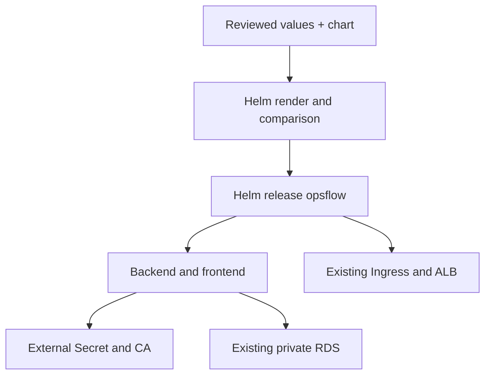

# Phase 7 — package and manage the existing OpsFlow application with Helm

## 1. Objective and starting point

Replace manual application manifest management with a versioned Helm chart and release history. Reuse the deployed frontend/backend, ECR digests, private RDS and existing ALB. Helm adds deployment packaging; it does not fix application bugs or provision the AWS foundation.

Your recent history includes Phase 6 verification output. The latest supplied markdown is a deployment checklist, not a completed results log. This phase does not declare unseen browser/persistence/rollback steps complete. Do not rebuild images, rescan unchanged digests, create extra incidents or repeat unrelated tests just to learn Helm. The migration needs only current target/readiness checks, a manifest comparison, rollout checks and read-only acceptance.

This package was prepared offline. Live adoption, installation and rollback are not yet completed. Mark each step complete only after its command succeeds and its expected output is observed.

## 2. Production relevance and ownership

| Managed by this application release | Stays external |
|---|---|
| Deployments backend/frontend | EKS/VPC/ECR/RDS Terraform state |
| Services backend-service/frontend-service | Database and schema migrations |
| ConfigMaps opsflow-config/frontend-nginx-config | Secret opsflow-db-secret and CA ConfigMap rds-ca |
| Ingress opsflow | Namespace opsflow and load balancer controller release |

The seven existing names and `app: backend/frontend` selectors stay fixed. Release name and namespace must both be `opsflow`. This chart deliberately does not support a second release in the same namespace. Multi-environment reuse needs separate namespaces and deliberate name/routing design.



Helm tracks chart, supplied values and revision manifests in Kubernetes release records. Never put a DB password in values, `--set`, chart templates, Git or release notes. The existing Secret is referenced by name. Anyone permitted to read release records can see the stored values/manifests.

## 3. Files and prerequisites

```
helm/opsflow/
  Chart.yaml
  values.yaml
  values.schema.json
  templates/_helpers.tpl
  templates/backend.yaml
  templates/frontend.yaml
  templates/configmap.yaml
  templates/nginx.yaml
  templates/ingress.yaml
  templates/NOTES.txt
scripts/phase7/
  Export-LiveValues.ps1
  Adopt-Resources.ps1
docs/phase7-helm.md
docs/phase7-results-template.md
.phase7/.gitignore
```

Merge the supplied directories into the existing repository. Inspect any existing `helm/opsflow` files first; preserve unrelated chart work and your root README. The templates contain complete Deployment security contexts, requests/limits, health probes, tmp volumes, TLS CA mounting, service routing and Ingress configuration. No placeholder application is included.

This guide is tested with Helm **3.19.0** and uses Helm 3 flags. Keep the major version consistent. Helm 4 has different failure/wait options; don't silently substitute it. Use an official Helm 3 binary approved for your environment, verify its checksum, and record `helm version --short`. The scripts stop if they encounter Helm 4. A chart's SemVer `version` is its packaging version; `appVersion` is informational. The images actually deployed are the two ECR digest values.

Required: current Phase 5 infrastructure, Phase 6 `scripts/phase6/Common.ps1`, a healthy application, kubectl/Helm/AWS CLI/Terraform, initialized correct Terraform backend, authorized AWS session and Kubernetes write access. No new infrastructure is required.

Default values intentionally have no image/DB endpoint/Nginx config. Bare `helm lint` fails until actual environment values are supplied. That prevents accidental installation using fake defaults.

## 4. Start a fresh Windows PowerShell session

```powershell
Set-Location 'C:\Users\ROHIT\Desktop\aws-eks-ops-platform'
$OpsRepoRoot = (Get-Location).Path
$OpsExpectedAccount = '952078551971'
$OpsRegion = 'ap-south-1'
$OpsCluster = 'opsflow-lab'
$OpsContext = 'opsflow-eks'
$env:AWS_REGION = $OpsRegion
$env:AWS_DEFAULT_REGION = $OpsRegion
$env:AWS_PAGER = ''
# Use your existing authorized profile; don't replace it with an invented name.
aws sts get-caller-identity
helm version --short
kubectl --context $OpsContext get deployments,services,ingress -n opsflow
```

Expected: intended account and context, current available replicas and the existing ALB. If Phase 5 was destroyed, stop and restore/recreate it deliberately using its guide. A Helm install cannot recreate EKS or restore an RDS snapshot. No dependency bootstrap is needed for a healthy current application.

## 5. Export current values and capture a recovery baseline

```powershell
.\scripts\phase7\Export-LiveValues.ps1 -ExpectedAccountId $OpsExpectedAccount `
  -Region $OpsRegion -Cluster $OpsCluster -Context $OpsContext
$OpsMigration = 'PASTE_THE_EXACT_MIGRATION_FOLDER_PRINTED_BY_THE_SCRIPT'
$OpsValues = Join-Path $OpsMigration 'values-live.json'
$OpsChart = Join-Path $OpsRepoRoot 'helm\opsflow'
Get-Content $OpsValues
```

The export reads exactly seven non-secret resources, validates account/context, ECR digests, available Deployments, TLS config, current RDS endpoint and HTTP database readiness. It captures the actual Nginx config, ConfigMap data, replicas/resources and ALB annotations. It does not change the cluster. Backup JSON contains operational metadata and annotation history; keep it private and do not paste it wholesale into chat.

The script refuses another Helm owner, a pre-existing release, mutable image tags, a broad allowlist, mismatched DB or failed readiness. Existing metadata claiming another manager requires deliberate review. It does not overwrite that owner.

Expected output: chart lint success and a timestamped migration folder containing `baseline.json` and `values-live.json`. **Step completed only after those outputs exist and the command exited successfully.**

## 6. Render and compare before ownership changes

```powershell
$OpsRendered = Join-Path $OpsMigration 'rendered.yaml'
helm template opsflow $OpsChart -n opsflow -f $OpsValues | `
  Set-Content -Encoding utf8 $OpsRendered
if ($LASTEXITCODE -ne 0) { throw 'Helm rendering failed' }
kubectl --context $OpsContext apply --dry-run=server -f $OpsRendered
if ($LASTEXITCODE -ne 0) { throw 'Server validation failed' }
kubectl --context $OpsContext diff -f $OpsRendered
$OpsDiffExit = $LASTEXITCODE
if ($OpsDiffExit -gt 1) { throw 'Diff failed; exit 1 means a diff, not an error' }
```

Compare all seven resources. Expected differences: Helm/chart labels and Pod configuration checksums. Check that image digests, replicas/resources, DB host/TLS settings, Nginx routing, ALB annotations, service ports, security contexts, selectors and resource names match the real deployment. Any unexplained change must be reconciled in the chart before adoption. Live changes you made after Phase 5 may require extending the template; exporting values cannot automatically preserve arbitrary Pod/spec fields.

Do not use `kubectl apply` without `--dry-run=server` here. The dry run does not create a Helm release. Do not use `--force` or recreate Services/Ingress to hide a diff.

Checksums ensure ConfigMap changes roll Pods, including the frontend subPath-mounted nginx.conf. Both Pod templates intentionally reference both checksums, so either ConfigMap change can roll both applications. This conservative behavior is acceptable for this small lab.

## 7. Adopt the seven resources, then install revision 1

A pre-existing resource usually needs Helm ownership metadata before installation. We explicitly annotate only the reviewed seven resources rather than using blanket `--take-ownership`.

```powershell
.\scripts\phase7\Adopt-Resources.ps1 -MigrationFolder $OpsMigration
if (-not $?) { throw 'Ownership adoption failed' }
helm install opsflow $OpsChart -n opsflow --kube-context $OpsContext `
  -f $OpsValues --wait --timeout 10m
if ($LASTEXITCODE -ne 0) { throw 'First Helm install failed. Diagnose; follow initial-adoption recovery below.' }
helm status opsflow -n opsflow --kube-context $OpsContext
helm history opsflow -n opsflow --kube-context $OpsContext
```

The script checks all UIDs/resourceVersions before mutating metadata. If a resource changed since export, re-export and review the current snapshot. It fails rather than silently adopt stale state. Metadata changes are not a transaction: if the script fails partway through, inspect all seven ownership annotations and repair deliberately; don't blindly rerun it or overwrite another owner.

Do **not** add `--atomic` to this first installation. First-install failure cleanup can delete the adopted live resources, including Ingress. There is no pre-Helm revision in Helm history. Keep the baseline and diagnose a failed first install in place. `--wait` is only Kubernetes rollout readiness; it is not full browser/API acceptance.

Expected: release status deployed, revision 1, both Deployments available. Names and ALB hostname remain the same; checksum annotations can trigger Pod replacement. No DB/schema changes are executed.

## 8. Minimal acceptance after migration

```powershell
kubectl --context $OpsContext rollout status deployment/backend -n opsflow --timeout=300s
kubectl --context $OpsContext rollout status deployment/frontend -n opsflow --timeout=300s
kubectl --context $OpsContext get ingress opsflow -n opsflow
# Use the actual Phase 6 release record for the currently running images.
$OpsReleaseFile = 'PATH_TO_CURRENT_PHASE6_RELEASE_JSON'
.\scripts\phase6\Verify-Release.ps1 -ReleaseFile $OpsReleaseFile
```

Omit `-CreateTestIncident`. This migration should reuse existing images/data; it does not justify another synthetic incident or a container rebuild. Confirm the existing frontend loads once and existing incidents can be read. If the previous browser checks were already completed and the migration changed only packaging/checksums, don't repeat an unrelated full CRUD suite.

Record current image digests, ALB hostname, revision and acceptance results. **Migration complete only after revision 1 is deployed and these read-only checks pass.**

Stop using Phase 6 Deploy-Release, Rollback-Release or direct Kustomize apply for these seven resources afterward. Phase 6 Build-Release and read-only Verify-Release remain useful. Running two managers creates drift and makes Helm rollback unreliable.

## 9. A meaningful Helm upgrade and rollback

Use a harmless configuration/resource change instead of fabricating a new application release. This exercise proves a second Helm revision and restoration without repeating app builds/scans. Keep enough node capacity for maxSurge=1.

```powershell
$OpsValuesB = Join-Path $OpsMigration 'values-b.json'
$OpsB = Get-Content $OpsValues -Raw | ConvertFrom-Json
$OpsB.frontend.resources.requests.cpu = '60m'
$OpsB | ConvertTo-Json -Depth 100 | Set-Content -Encoding utf8 $OpsValuesB
helm lint $OpsChart -n opsflow -f $OpsValuesB --strict
if ($LASTEXITCODE -ne 0) { throw 'Lint failed' }
helm upgrade opsflow $OpsChart -n opsflow --kube-context $OpsContext `
  -f $OpsValuesB --atomic --wait --timeout 10m --history-max 10
if ($LASTEXITCODE -ne 0) { throw 'Upgrade failed. Check history/status before taking further action' }
helm history opsflow -n opsflow --kube-context $OpsContext
```

Record the actual deployed revision. If 60m is already your original request, choose a different small reviewed request; don't decrease below operational needs. Use a complete values file each time; avoid `--reuse-values` carrying hidden stale settings. An unchanged chart version can have multiple release revisions. Bump chart version when committing a changed chart, not for every environment values change.

For a real new app release later, build/test/scan only changed source, set both intended digest values explicitly and run this upgrade path. Do not purge old digest images needed by retained revisions.

Choose the **actual verified prior revision** from history, not an assumed number:

```powershell
$OpsPreviousRevision = 1 # replace if history shows another verified prior revision
helm rollback opsflow $OpsPreviousRevision -n opsflow --kube-context $OpsContext `
  --wait --timeout 10m
if ($LASTEXITCODE -ne 0) { throw 'Rollback failed' }
helm history opsflow -n opsflow --kube-context $OpsContext
kubectl --context $OpsContext get deployment frontend -n opsflow `
  -o jsonpath='{.spec.template.spec.containers[0].resources.requests.cpu}'
.\scripts\phase6\Verify-Release.ps1 -ReleaseFile $OpsReleaseFile
```

Expected: original request restored and a new Helm revision recording the rollback. Helm does not move history backward or restore RDS/schema/Secret contents. For image-changing upgrades, verify against the Phase 6 record corresponding to the restored digest, not the failed/new record. `--atomic` can roll back Kubernetes resources on a failed upgrade, but does not make cloud reconciliation or external database changes transactional.

One successful upgrade and rollback are sufficient here. Don't inject a bad digest, disable probes, kill RDS or force a downtime experiment merely to prove automatic rollback.

## 10. Packaging and Git

```powershell
$OpsPackages = Join-Path $OpsRepoRoot '.phase7\packages'
New-Item -ItemType Directory -Force $OpsPackages | Out-Null
helm package $OpsChart --destination $OpsPackages
if ($LASTEXITCODE -ne 0) { throw 'Chart packaging failed' }
helm show chart (Join-Path $OpsPackages 'opsflow-0.1.0.tgz')
git status --short
git add helm/opsflow scripts/phase7 docs/phase7-helm.mddocs/phase7-results-template.md .phase7/.gitignore
# Fill and add docs/phase7-results.md with actual sanitized results.
git diff --cached
# Confirm no DB password, generated baseline/values, credentials or Terraform state is staged.
git commit -m 'feat: manage OpsFlow application releases with Helm'
git push origin main
```

Add a short section to your existing README linking phase7-results.md and stating the resource ownership boundaries. The chart archive contains defaults/templates, not your environment-specific values. Chart OCI publishing/CI automation belongs in the next pipeline phase; no new ECR chart repository is necessary now.

## 11. Failure diagnosis and first-adoption recovery

| Symptom | Necessary next action |
|---|---|
| Schema/lint failure | Supply exported values; fix the exact field, never skip schema validation |
| Wrong account/context | Fix the authorized session/context; retain guardrails |
| Existing ownership conflict | Inspect owning release and namespace; don't use blanket take-ownership |
| Resource changed after export | Re-export, compare current state, then retry before any ownership changes |
| Partial metadata adoption | Inspect the seven labels/annotations; complete or remove only newly added metadata deliberately |
| Pending install/upgrade | Read helm status/history and Pod Events; determine whether a command is still running |
| Failed first install | Keep resources/release records; fix forward with reviewed helm upgrade, or execute controlled recovery below |
| Upgrade not ready | Inspect Pod Events, requests/capacity, readiness and image pull; atomic result must be confirmed in history |
| Ingress/ALB changed | Compare exact names/annotations; resolve ownership/config rather than create a second Ingress |
| Secret/schema failure | Resolve external dependency; Helm rollback cannot rotate passwords or restore DB |

```powershell
helm status opsflow -n opsflow --kube-context $OpsContext
helm history opsflow -n opsflow --kube-context $OpsContext
kubectl --context $OpsContext get events -n opsflow --sort-by=.metadata.creationTimestamp
kubectl --context $OpsContext logs deployment/backend -n opsflow --tail=100
```

Do not delete `sh.helm.release.v1.*` Secrets to clear a lock before confirming there is no active operation and saving release history. Do not use `helm uninstall` as an innocent retry; it deletes release-managed resources and can remove the ALB via Ingress deletion.

For a failed initial adoption, the preferred recovery is a reviewed fix-forward upgrade of the existing failed release, without atomic rollback until a valid deployed revision exists. If you must return to pre-Helm management, use the captured baseline and a deliberate recovery window: inspect current Helm status, sanitize its resource List (remove status, managedFields, uid/resourceVersion/generation/timestamps and stale last-applied annotations), server-dry-run then apply exactly the seven prior resource specs. That restores the app specs while preserving resource identities. It does not automatically remove Helm ownership or history. Keep the failed release record until you have a specific plan to retire its ownership/history without uninstalling the restored app. This is an exceptional recovery, not an automatic script in this package. Revision 1 has no pre-Helm rollback target.

## 12. Security, AWS costs and cleanup

No new EKS, RDS or ALB is needed. Helm itself adds no AWS service fee; the same EC2/EKS/RDS/ALB/public IPv4/storage/log/traffic charges continue. Release history adds small Kubernetes Secret records; upgrades create temporary surge Pods, which require available capacity. No exact bill is promised. Laptop shutdown does not stop cloud charges.

Keep HTTP restricted to the current admin /32, digest-pinned images, TLS verification, external app credentials and least-privilege Kubernetes access. Never include production/customer data in this lab. Schema validation is not a comprehensive security scanner. No DB migrations run as Helm hooks: infrastructure/data lifecycle must be reviewed separately.

If continuing to Phase 8, do not uninstall just to finish Phase 7. If intentionally stopping the lab, preserve recovery evidence and decide RDS snapshot retention first.

```powershell
# Destructive: removes the seven application resources, including Ingress.
helm uninstall opsflow -n opsflow --kube-context $OpsContext --wait --timeout 10m
```

Keep the ALB controller/identity/nodes operating until the exact ALB is confirmed deleted in AWS. Helm's wait alone is not proof cloud resources are gone. The namespace, CA ConfigMap and application Secret remain because this chart does not own them. RDS data stays in the external RDS instance. Then use the Phase 5/4 teardown order and verify residual snapshots/ECR/logs/ENIs. Do not `kubectl delete -k` the old manifests after Helm adoption. Don't delete the namespace while you still need its external Secret.

## 13. Completion evidence and interview explanation

Use the supplied results template. Mark each step complete based on actual outputs: export/lint, reviewed server validation/diff, ownership adoption, deployed revision 1, minimal acceptance, successful upgrade, rollback to a verified revision, packaged chart and committed documentation. A prepared chart alone does not complete Phase 7.

Explain: “I converted the existing EKS application manifests into a versioned Helm chart. I captured current values and a recovery baseline, preserved Services/Ingress names and selectors, and adopted exactly seven resources. Helm handles app configuration and release history; Terraform handles AWS infrastructure, and database credentials/migrations stay external. I validated a configuration upgrade and rollback, and documented that rollback cannot restore database changes.” Use this explanation only for operations you actually completed.

Official references:
- https://helm.sh/docs/topics/charts/
- https://helm.sh/docs/helm/helm_install/
- https://helm.sh/docs/helm/helm_upgrade/
- https://helm.sh/docs/helm/helm_rollback/
- https://helm.sh/docs/topics/charts_hooks/
- https://github.com/helm/helm/tree/v3.19.0
